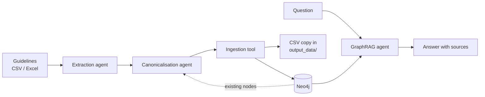

# Multi-Agent Workflow for Requirements Selection

[](https://github.com/SalehPouresmaeeli/multi-agent-workflow-requirements-selection/actions/workflows/tests.yml)

A multi-agent system that turns design guidelines into a knowledge graph, answers questions about it in plain language, and explains design trade-offs to engineers.

Built with [CrewAI](https://www.crewai.com/), [Neo4j](https://neo4j.com/) and LLMs accessed through [OpenRouter](https://openrouter.ai/).

## What it does

The project has following features:

1. **Knowledge graph ingestion pipeline:** upload a sheet of design guidelines. An extraction agent maps each guideline onto a fixed engineering vocabulary, a canonicalisation agent merges duplicates and synonyms, and the result is written to Neo4j. Every relationship keeps a record of the guideline it came from (reference, source type, relevance).
2. **GraphRAG query agent:** ask the graph a question in plain English. The agent writes read-only Cypher queries, retries if a query finds nothing, and answers with a source for every fact.
3. **Design mentor:** set your priorities (durability vs disassembly) with sliders. A scoring engine picks the winning design rule, and a mentor agent explains why it won.



## Requirements

- **Python 3.11** (tested with 3.11.9)
- **Python packages:** listed in `requirements.txt` with the tested versions pinned (CrewAI, Neo4j driver, FastAPI, Streamlit, pandas and others). They are installed in [Setup](#setup), step 1.
- **Neo4j:** a local database, e.g. [Neo4j Desktop](https://neo4j.com/download/). The ingestion tool creates its database automatically if it doesn't exist, which needs a Neo4j edition that supports multiple databases (Desktop does).
- **An OpenRouter API key** for the default models. A Gemini API key is only needed if you switch to direct `gemini/...` models (see [Choosing models](#choosing-models)).

## Setup

**1. Install the dependencies** in a virtual environment:

```powershell
python -m venv .venv
.venv\Scripts\activate          # macOS / Linux: source .venv/bin/activate
pip install -r requirements.txt
```

**2. Add your API keys.** Copy `.env.example` to `.env` and fill in your keys:

```
GEMINI_API_KEY=
OPENROUTER_API_KEY=
```

**3. Add your Neo4j connection details.** Copy `db_config.example.json` to `db_config.json` and set your password:

```json
{
  "uri": "neo4j://localhost:7687",
  "username": "neo4j",
  "password": "your-password-here",
  "database_name": "neo4j"
}
```

**4. Check the LLM connection** (optional):

```powershell
python .\src\tools\llm_config.py rag_agent
```

It sends one short request with the model configured for `rag_agent` and should print `Response: OK`.

## Usage

Run every command from the project root.

### Knowledge graph web app

```powershell
uvicorn web.web_app_KG:app --reload
```

Then open http://localhost:8000.

- **Update Knowledge Graph:** upload a CSV or Excel file (`.xlsx` / `.xlsm`), optionally naming the sheet. Progress is shown live in the **AI Agents Tracker**.
- **Knowledge Graph Query Tool:** ask a question, e.g. *"Which design guidelines come from reference [4]?"* or *"Which High relevance guidelines enable remanufacturing, and what are their sources?"*

The uploaded sheet should have one guideline per row, with these columns:

| Column | Example |
|---|---|
| Lifecycle activity | Design to recover value |
| DfReX | Remanufacturing |
| Product requirement | Select non-permanent joints |
| Design criteria | Use non-permanent joint types rather than adhesives |
| Ref | [4] |
| Source Type | Academic paper |
| Relevance | High |

Each upload also saves a copy of the ingested graph to `output_data/graph_<timestamp>/` (`ingested_nodes.csv` and `ingested_edges.csv`).

### Query the graph from the terminal

```powershell
python .\src\agents\rag_agent.py
```

This starts an interactive question loop; type `exit` to stop.

### Design mentor web app

```powershell
streamlit run .\web\web_app_mentor.py
```

Set the durability and disassembly sliders and click **Calculate Best Design**. The sample design conflict (adhesive vs screws for an outer casing) is defined in `src/tools/conflicts.json`.

### Test individual components

Each of these files has a small local test at the bottom:

| Command | What it tests |
|---|---|
| `python .\src\agents\knowledge_extraction_agent.py` | Extraction and canonicalisation on sample guideline records (no database needed) |
| `python .\src\tools\neo4j_ingestion.py` | Writing a sample graph to a separate `KnowledgeGraphTEST` database |
| `python .\src\tools\neo4j_query.py` | Reading from `KnowledgeGraphTEST` |
| `python .\src\tools\math_engine.py` | The design-rule scoring engine |

### Run the tests

- **Unit tests** (free, no LLM or database needed, run automatically on GitHub):
  `python -m pytest`
- **Integration tests** (real Gemini model and Neo4j; needs `GEMINI_API_KEY` in `.env` and Neo4j running):
  `python -m pytest -m integration -v`
  They write only to a separate `integrationtest` database, never to your own graph.

## Choosing models

Each agent's model is set in `llm_config.json`, so you can change it without touching the code:

```json
{
  "default_model": "openrouter/google/gemini-3.8-flash",
  "agents": {
    "extraction_agent": "openrouter/google/gemini-3.8-flash",
    "canonicalisation_agent": "openrouter/google/gemini-3.8-flash",
    "rag_agent": "openrouter/google/gemini-3.8-flash",
    "mentor_agent": "openrouter/google/gemini-3.8-flash"
  }
}
```

- Names starting with `openrouter/` go through OpenRouter, using `OPENROUTER_API_KEY`. Any [OpenRouter model](https://openrouter.ai/models) can be used this way.
- Other names, such as `gemini/gemini-3.5-flash-lite`, go directly to that provider and need its key (here `GEMINI_API_KEY`).
- An agent without its own entry uses `default_model`.

Useful helper scripts:
- `python .\src\tools\credit_check_requests.py` shows the usage and remaining credit of your OpenRouter key.
- `python .\src\tools\check_models.py` lists the Gemini models available to your Gemini key.

## Project structure

```
├── src/
│   ├── agents/
│   │   ├── knowledge_extraction_agent.py   # guidelines -> raw knowledge graph
│   │   ├── canonicalisation_agent.py       # merges duplicates, standardises the graph
│   │   ├── ingestion_pipeline.py           # extraction -> canonicalisation -> Neo4j
│   │   ├── rag_agent.py                    # GraphRAG question answering
│   │   └── mentor_agent.py                 # explains design-rule trade-offs
│   └── tools/
│       ├── pydantic_schemas.py             # graph schema and fixed vocabulary
│       ├── neo4j_ingestion.py              # writes graphs to Neo4j (+ CSV copy)
│       ├── neo4j_query.py                  # read-only Cypher query tool
│       ├── llm_config.py                   # per-agent model selection
│       ├── db_config.py                    # loads Neo4j connection details
│       ├── math_engine.py                  # weighted scoring of design rules
│       ├── conflicts.json                  # sample design conflict
│       ├── excel_sheet_to_json.py          # converts the guideline sheet to JSON
│       ├── check_models.py                 # lists available Gemini models
│       └── credit_check_requests.py        # shows OpenRouter key usage
├── web/
│   ├── web_app_KG.py                       # knowledge graph web app (FastAPI)
│   ├── index.html                          # its single-page UI
│   ├── web_app_mentor.py                   # design mentor web app (Streamlit)
│   └── static/                             # images
├── llm_config.json                         # model per agent
├── requirements.txt
├── .env.example                            # template for API keys
└── db_config.example.json                  # template for Neo4j credentials
```

## How to cite

If you use this software in your work, please cite it. Use the
**"Cite this repository"** button on the GitHub page, or see [`CITATION.cff`](CITATION.cff).

## License

No license. All rights are reserved.

## Contact

- **Questions and bug reports:** please open an [issue](https://github.com/SalehPouresmaeeli/multi-agent-workflow-requirements-selection/issues).
- **Collaboration and industry pilots:** connect with the developer on [LinkedIn](https://www.linkedin.com/in/saleh-pouresmaeeli/).
